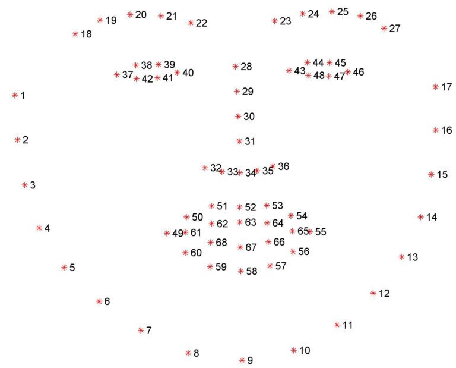

## Run
1. Setting
```bash
pip install opencv-python   
pip install cmake
pip install opencv-contrib-python dlib
```
2. Download shape_predictor_68_face_landmarks.dat
```bash
wget http://dlib.net/files/shape_predictor_68_face_landmarks.dat.bz2
bunzip2 shape_predictor_68_face_landmarks.dat.bz2
```

3. Camera Path or Index
```bash
vi detecting_eyes.py
```
```python
# default
cap = cv2.VideoCapture(0)

# example1
cap = cv2.VideoCapture(1)

# example2
cap = cv2.VideoCapture("/dev/video0")   # Linux
```

4. run
```bash
python3 detecting_eyes.py
```

## About "68 facial landmark"
- Information of the file "shape_predictor_68_face_landmarks.dat" 
  - 68 facial landmark coordinates([source imaage](https://www.pyimagesearch.com/2017/04/03/facial-landmarks-dlib-opencv-python/))
  


## Reference site
1. <https://minsoo-study.tistory.com/3?category=856171>
2. <https://minsoo-study.tistory.com/4?category=856171>
3. <https://m.blog.naver.com/PostView.naver?isHttpsRedirect=true&blogId=zzing0907&logNo=221612308385>
4. <https://www.pyimagesearch.com/2017/04/03/facial-landmarks-dlib-opencv-python/>
5. <https://hidden-loca.tistory.com/6>


